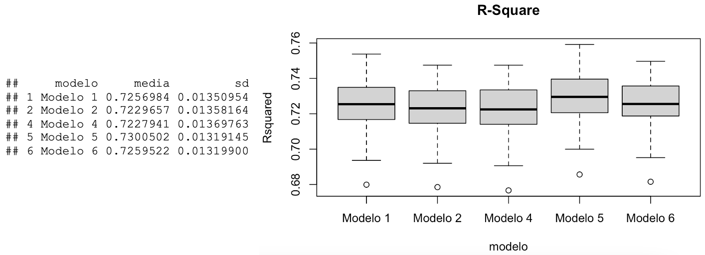
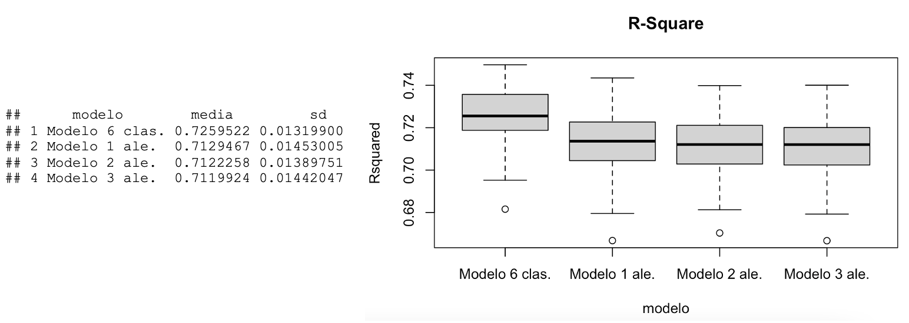
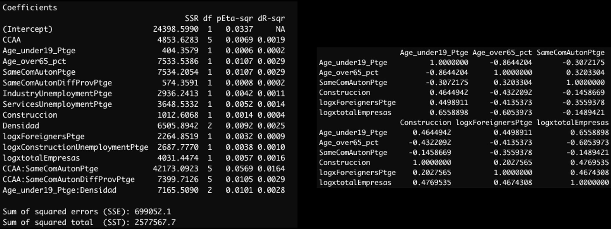
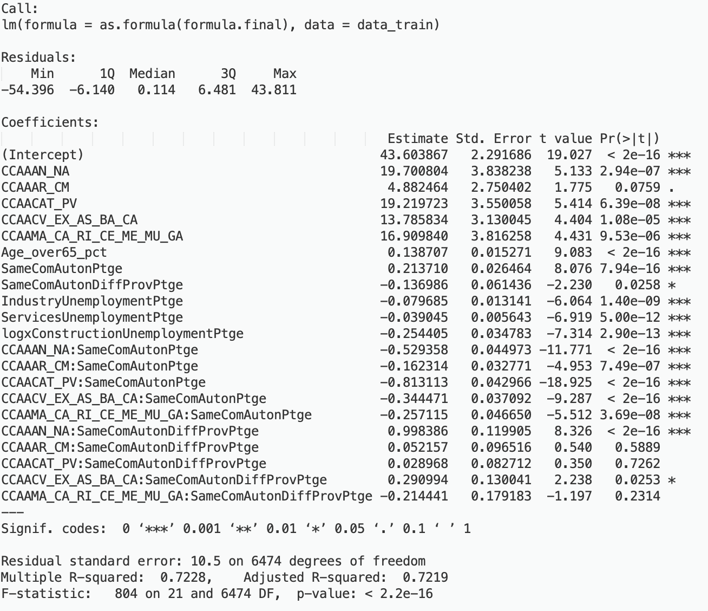
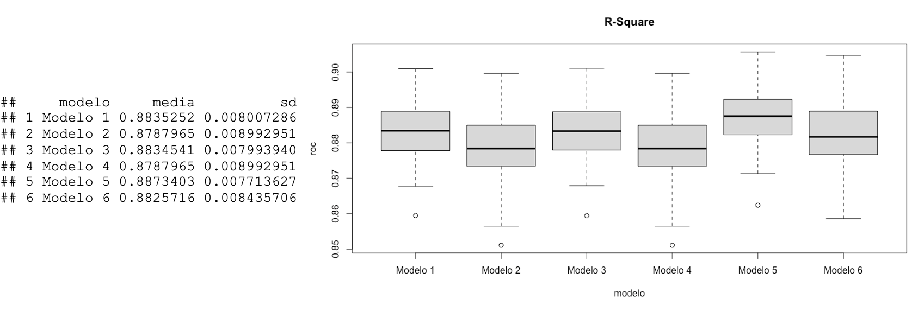
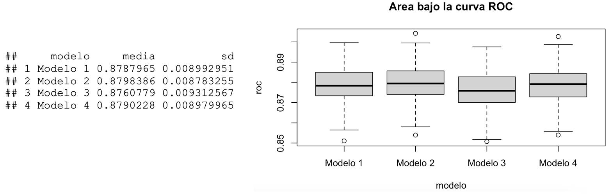
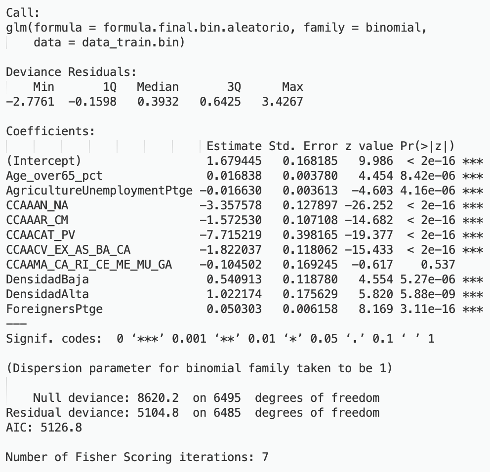

```{r setup, include=FALSE}
knitr::opts_chunk$set(echo = TRUE)
```
\newpage
\small
```{r, echo=FALSE, include=FALSE}
source("FuncionesRosa.R")
library(readxl)
datos <- read_excel("DatosEleccionesEspaña.xlsx",sheet = 1)
```
# 1. Depuración de los datos
## 1.1 Introducción al objetivo del problema y las variables implicadas
El objetivo principal del problema consiste en __obtener un modelo tanto de regresión lineal como de regresión logística que permita calcular no solo el porcentaje de votos a la derecha en un municipio (Dcha_Pct), sino además predecir si en un municipio habrá una mayoría o no de votos a la derecha (campo Derecha).__ Para ello, contamos con las siguientes columnas con la información de los municipios en España (8119 observaciones):

\footnotesize
```
["Name", "CodigoProvincia", "CCAA", "Population", "TotalCensus", "Dcha_Pct", "Derecha", "Age_0-4_Ptge", "Age_under19_Ptge",
"Age_19_65_pct", "Age_over65_pct", "WomanPopulationPtge", "ForeignersPtge", "SameComAutonPtge", "SameComAutonDiffProvPtge",
"DifComAutonPtge", "UnemployLess25_Ptge", "Unemploy25_40_Ptge", "UnemployMore40_Ptge", "AgricultureUnemploymentPtge",
"IndustryUnemploymentPtge", "ConstructionUnemploymentPtge", "ServicesUnemploymentPtge", "totalEmpresas", "Industria",
"Construccion", "ComercTTEHosteleria", "Servicios", "ActividadPpal", "inmuebles", "Pob2010", "SUPERFICIE", "Densidad",
"PobChange_pct", "PersonasInmueble", "Explotaciones"] => Total variables: 36
```
\small
En primer lugar, y una vez eliminadas el resto de variables objetivo, debemos __recategorizar las variables cualitativas como factor__, dado que el formato establecido por defecto es numérico o cadena de caracteres. Debido a que contienen un número limitado de valores, existen un total de 4 variables categóricas, incluyendo la variable objetivo binaria (Derecha), así como los campos CodigoProvincia, CCAA, ActividadPpal y Densidad:
```{r, echo=FALSE}
datos <- datos[, -c(6,7,8,10,11)]
```
```{r}
# c(2,3,7,29,33) -> (CodigoProvincia, CCAA, Derecha, ActividadPpal, densidad)
datos[,c(2,3,7,29,33)] <- lapply(datos[,c(2,3,7,29,33)], factor)
```
```{r, echo=FALSE}
cat("Categorias CodigoProvincia: ", length(levels(datos$CodigoProvincia)), "; CCAA: ", length(levels(datos$CCAA)), "; Derecha: ", length(levels(datos$Derecha)) , " ; ActividadPpal: ", length(levels(datos$ActividadPpal)), "; Densidad: ", length(levels(datos$Densidad)) ,"\n")
```
```{r, echo=FALSE}
varObjCont <- datos$Dcha_Pct
varObjBin <- datos$Derecha
datos <- datos[, -c(6:7)]
```
Por otro lado, podemos observar que los datos proporcionados __contienen un total de 34 variables independientes__, de las cuales cabe destacar el campo identificador _Name_, un campo con el nombre de cada municipio:

```{r, echo=FALSE}
cat("Nombres de municipio unicos: ", length(unique(datos$Name)), " de ", nrow(datos), "filas.\n")
```

Salvo excepciones, en las que el nombre del municipio coincide, se trata de un campo que podríamos considerar como identificativo, por lo que no nos aportará información relevante al modelo y por ello lo eliminamos.

```{r,echo=FALSE}
datos <- datos[, -c(1)] # Eliminamos el campo identificador
```

Por otro lado, nos encontramos con el campo _CodigoProvincia_ que, a diferencia del anterior, el número de valores diferentes es significativamente menor (52 valores únicos). No obstante, nos encontramos ante la siguiente duda ¿Mantenemos el campo o lo eliminamos? Por un lado, recategorizarlo como una variable cualitativa puede llegar a entorpecer la elaboración del modelo, en especial si una o varias de las categorías no están lo suficientemente representadas y deben ser agrupadas. Además, nos encontramos con un segundo problema: __el código de provincia depende la CCAA asociada:__:

```{r, warning=FALSE}
sapply(datos[, c("CodigoProvincia")],function(x) Vcramer(x,datos$CCAA)) # Correlacion perfecta (1)
```

¿Cuál debemos eliminar? En primera instancia, deberíamos descartar aquella variable que esté menos relacionada con nuestras variables objetivo, según la V de Cramer:

```{r, warning=FALSE}
sapply(datos[, c("CodigoProvincia", "CCAA")],function(x) Vcramer(x,varObjCont))
sapply(datos[, c("CodigoProvincia", "CCAA")],function(x) Vcramer(x,varObjBin))
```

Como primeros resultados, la V de Cramer obtenida nos indica que el código de la provincia está mejor relacionada con las variables objetivo. Sin embargo, debemos recordar el número de categorías de cada variable: en el caso de la Comunidad Autónoma, con 33 categorías menos la diferencia entre ambas relaciones es de apenas 0.011 en la variable objetivo binaria y de 0.018 en la variable objetivo continua, con muchas menos categorías, por lo que no parece ser tan necesario conocer de qué provincia proviene el municipio, sino que con la CCAA parece ser suficiente.  Por otro lado, muchas de las categorías en CódigoProvincia podrían estar muy poco representadas. A modo de ejemplo, de las 52 provincias, 18 de ellas tienen menos de 100 valores en el conjunto de datos, lo que podría suponer no solo recategorizarlas, sino además de ser un proceso computacionalmente más costoso de cara a la elaboración de los modelos (especialmente en la regresión logística):

```{r}
sum(freq(datos$CodigoProvincia)$`n` < 100)
```

Por otro lado, ¿Y si lo consideramos como variable numérica? ¿Mejora la V de Cramer?

```{r, echo=FALSE}
datos$CodigoProvincia <- as.numeric(datos$CodigoProvincia)
cat("VarObjCont: ", sapply(datos[, c("CodigoProvincia")],function(x) Vcramer(x,varObjCont)), "; VarObjBin: ", sapply(datos[, c("CodigoProvincia")],function(x) Vcramer(x,varObjBin)), "\n")
```

Tampoco parece mejorar. Por tanto, dado que la diferencia V Cramer entre ambas variables no es tan significativa pese aumentar el número de categorías, __elegimos la CCAA, por lo que eliminamos CodigoProvincia__. Antes de continuar, de cara a valorar la calidad de la depuración final guardamos en una variable los valores de correlación originales, con el objetivo de compararlos con los del conjunto de datos ya depurado:

```{r, echo=FALSE}
datos <- datos[, -c(1)]
```

```{r}
corr.previa <- cor(datos[,unlist(lapply(datos, is.numeric))], use="complete.obs", method="pearson")
```

## 1.2 Valores erróneos o no declarados

A continuación, procedemos a eliminar aquellos valores no declarados en las variables, así como posibles valores fuera de rango:

1. _ForeignersPtge_ negativos. Porcentajes de extranjeros menores a cero:

```{r, echo=FALSE}
summary(datos$ForeignersPtge)
```

```{r}
datos$ForeignersPtge<-replace(datos$ForeignersPtge, which(datos$ForeignersPtge < 0), NA)  # Min < 0
```

2. Porcentajes de _SameComAutonPtge_ y _PobChange_pct_ superiores al 100 % (en el caso de _PobChange_pct_ según la documentación son posibles los porcentajes negativos, aunque no menciona los porcentajes mayores a 100):

```{r, echo=FALSE}
summary(datos$SameComAutonPtge)
```

```{r}
datos$SameComAutonPtge <-replace(datos$SameComAutonPtge, which(datos$SameComAutonPtge > 100), NA)
```

```{r, echo=FALSE}
summary(datos$PobChange_pct)
```

```{r}
datos$PobChange_pct <-replace(datos$PobChange_pct, which(datos$PobChange_pct > 100), NA) # Max > 100
```

3. Valores a 99.999 en la columna _Explotaciones_, posible indicativo de la ausencia de valores en estos casos:

```{r, echo=FALSE}
summary(datos$Explotaciones)
```

```{r}
datos$Explotaciones<-replace(datos$Explotaciones,which(datos$Explotaciones==99999),NA) # Max == 99999
```

4. Categoría "?" sin declarar en _Densidad_, por lo que lo recategorizamos a _NA_:

```{r, echo=FALSE}
t(freq(datos$Densidad)) # Nos encontramos con una categoria desconocida "?"
```

```{r, results='hide'}
datos$Densidad<-recode.na(datos$Densidad,"?")
```

## 1.3 Análisis de valores atípicos
Una vez corregidos los errores detectados, analicemos los valores atípicos más destacados empleando la función _describe_:

```{r, echo=FALSE}
describe(datos[c("Population", "TotalCensus", "totalEmpresas", "ComercTTEHosteleria", 
                 "Servicios", "inmuebles", "Pob2010", "SUPERFICIE")])[, c(4, 11, 12)]
```

Como podemos observar en la salida anterior, las columnas con la población, el censo total, el número total de empresas, así como la superficie son los que mayor desviación presentan con respecto a su media, lo que se traduce, además de una elevada asimetría, __en indicios de la presencia de valores atípicos__ (algo lógico si obervamos las desviaciones típicas obtenidas, donde en algunas variables como en el caso de _Population_ presentan desviaciones muy extremas, del orden de 46.000). Por ello, comenzamos analizando el porcentaje de valores atipicos en nuestro conjunto de datos (top 5):

```{r, echo=FALSE}
original <- sapply(Filter(is.numeric, datos),function(x) atipicosAmissing(x)[[2]]) * 100/nrow(datos)
head(sort(original, decreasing = T), 5)
```

En este caso, el máximo porcentaje corresponde con el campo _Servicios_, con un 11.87 %, además de que las variables con mayor porcentaje __corresponden con aquellas de elevada asimetría__. No obstante, ¿Es tan elevado el porcentaje de atípicos en cada columna? Veamos el porcentaje de _outliers_ mediante la función _summary_:

```{r, echo=FALSE}
summary(original)
```

Si nos fijamos en el tercer cuartil, podemos comprobar que no todas las columnas presentan un alto porcentaje de atípicos. De hecho, el 75 % de las columnas (26, aproximadamente) no supera el 10 % (menos de 800 filas en un conjunto de datos de más de 8.000), por lo que dada la proporción podemos considerar dichos valores como atípicos, recategorizándolos como _missing_:

```{r, echo=FALSE}
datos[,(which(sapply(datos, class)=="numeric"))]<-sapply(datos[, c(which(sapply(datos, class)=="numeric"))],function(x) atipicosAmissing(x)[[1]])
cat("Total valores missing: ", sum(is.na(datos)))
```

## 1.4 Análisis de valores missings (NA). Imputaciones
Tras recodificar los valores atípicos como ausentes, debemos analizar la proporción de valores atípicos tanto por observación como por variable. Para ello, obtenemos el valor máximo de _missings_ en ambos casos:

```{r, echo=FALSE}
datos$prop_missings<-apply(is.na(datos[, ]),1,mean) * 100
prop_missingsVars<-max(apply(is.na(datos[, ]),2,mean) * 100)
data.frame("Por observacion" = max(datos$prop_missings), "Por variable" = round(prop_missingsVars, 2))
```

Aparentemente, mientras que el porcentaje de _missings_ por variable es del 12.64 %, por observaciones detectamos un mayor número (37.5 %). No obstante, si empleamos la función _summary_ en este último caso:

```{r, echo=FALSE}
summary(datos$prop_missings)
```

Vemos que el 75 % de las observaciones contienen aproximadamente un 3 % de valores _missings_ o menos, por lo que no parece tratarse de varias filas (de hecho, solo el 25 % presenta un porcentaje de _missings_ superior al 3 %, con una media muy pequeña en comparación con el valor máximo, lo que indica que se tratan de observaciones atípicas). Por otro lado, la pérdida de información en ambos casos no supera el 50 %, por lo que en lugar de eliminar las filas o columnas podemos imputarlos. No obstante, existen determinados campos que pueden ser imputados manualmente sin necesidad de emplear una media, mediana o de forma aleatoria: 

1. _Age_19_65_pct_, cuyo porcentaje de edad puede calcularse a partir de la suma de _Age_under19_Ptge_ y _Age_over65_pct_ menos el 100 %:

```
x["Age_19_65_pct"] <- 100 - (as.numeric(x["Age_under19_Ptge"]) + as.numeric(x["Age_over65_pct"]))
# Ejemplo demostrativo de que 100 - Age_under19_Ptge + Age_over65_pct = Age_19_65_pct
```

```{r, echo=FALSE}
head(data.frame("Age_19_65_pct" = datos$Age_19_65_pct, "100-Age_under_19+Age_over65" = 100 - (datos$Age_under19_Ptge + datos$Age_over65_pct)), 3)
```

De hecho, solo se han encontrado 4 municipios en los que el _100 - (Age_under19_Ptge + Age_over65_pct_) no coincide, por lo que parece tratarse de posibles casos aislados en los que los porcentajes no son complementarios:

```{r, eval=FALSE}
sum(boxplot(abs((100 - (datos$Age_under19_Ptge + datos$Age_over65_pct)) - datos$Age_19_65_pct))$out > 1)
```
```{r, echo=FALSE}
sum(boxplot(abs((100 - (datos$Age_under19_Ptge + datos$Age_over65_pct)) - datos$Age_19_65_pct), plot = FALSE)$out > 1)
```

2. _totalEmpresas_ ¿Podría calcularse a partir de la suma del número de empresas de cada sector? _Industria_, _Construcción_, _ComercioTTEHostelería_ y _Servicios_. Una primera prueba para comprobar si el campo _totalEmpresas_ es la suma de cada columna podría ser analizando la matriz de correlación de valores _missings_: __Si falta cualquier sector, totalEmpresas tampoco debería aparecer al no poder calcularse__:

```{r, echo=FALSE, fig.height=3, fig.width=3, fig.align='center'}
corrplot(cor(is.na(datos[colnames(datos)[colSums(is.na(datos))>0]]))[c(1,2,13:19), c(1,2,13:19)],method = "ellipse",type = "upper", tl.cex = 0.5)
```

Efectivamente, __detectamos una correlación entre los valores _missing_ de _totalEmpresas_ con cada sector__. De hecho, no solo existe correlación entre _totalEmpresas_, sino incluso entre cada sector. A modo de ejemplo, si el número de empresas dedicadas al comercio no aparece, el número de empresas dedicadas a la construcción tampoco. Incluso si la población no aparece, tampoco suelen aparecer el número de empresas, el censo total e incluso tampoco la población registrada en el año 2010 (no se tratan de valores _missing_ aleatorios, siguen un patrón de correlación). Por tanto, el campo _totalEmpresas_ puede calcularse a partir de la suma de cada sector.

Como última prueba, realicemos una comprobación manual, sumando cada columna para comprobar si coincide con _totalEmpresas_:

```
x["totalEmpresas"] <- as.numeric(x["Industria"]) + as.numeric(x["Construccion"]) + 
                      as.numeric(x["ComercTTEHosteleria"]) + as.numeric(x["Servicios"])
# Ejemplo demostrativo de la suma de las empresas de cada sector, en funcion de ActividadPpal
```
```{r, echo=FALSE}
table(data.frame("Coincide_Suma?" = ifelse(datos$Industria + datos$Construccion + datos$ComercTTEHosteleria + datos$Servicios == datos$totalEmpresas, "SI", "NO"), "ActividadPpal" = datos$ActividadPpal))
```

Por lo general, cuando la actividad principal es _Otro_, la suma de cada columna no suele coincidir con _totalEmpresas_ (al ser predominante otro tipo de Actividad, el resto de columnas valen 0). No obstante, de los valores _missing_ de _totalEmpresas_, sólo existen 5 filas con la actividad principal a _Otro_, por lo que podemos realizar el cálculo manual sin afectar demasiado al conjunto de datos:

```{r, echo=FALSE}
table(datos[is.na(datos$totalEmpresas), c("ActividadPpal")])
```

Sin embargo, dado que existen valores _missing_ tanto de _Industria_, _Construcción_, _ComercTTEHosteleria_ como _Servicios_, realizaremos el cálculo manual una vez imputados el resto de campos:

```{r, echo=FALSE}
cat("Num. Missings Industria:", sum(is.na(datos$Industria)), "; Construccion:", sum(is.na(datos$Construccion)), "; ComercTTEHosteleria:", sum(is.na(datos$ComercTTEHosteleria)), "; Servicios:", sum(is.na(datos$Servicios)), "\n")
```

3. _Densidad_, cuyo valor puede obtenerse a través del cociente entre _Population_ y _SUPERFICIE_: si la proporcion es menor a 1 decimos que la densidad es "MuyBaja"; si está entre 1 y 5 decimos que es "Baja" y si es mayor a 5 diremos que es "Alta":

```
ifelse(proporcion < 1, densidad <- "MuyBaja", ifelse(proporcion >= 1 & proporcion <= 5, 
      densidad <- "Baja", densidad <- "Alta"))
# Ejemplo demostrativo del cociente entre Population y SUPERFICIE a traves de la funcion table
```
```{r, echo=FALSE}
table(data.frame("Densidad" = datos$Densidad, "Cociente_Pob_SUP" = ifelse((datos$Population / datos$SUPERFICIE) < 1, "Menor1", ifelse((datos$Population / datos$SUPERFICIE) > 1 & (datos$Population / datos$SUPERFICIE) < 5, "Entre1Y5", "Mayor5"))))
```

De nuevo, dado que existen valores _missing_ de _Population_ y _SUPERFICIE_, realizaremos el cálculo de la Densidad una vez realizada la imputación en ambos campos:

```{r, echo=FALSE}
cat("Num. Missings Population:", sum(is.na(datos$Population)), "; SUPERFICIE:", sum(is.na(datos$SUPERFICIE)), "\n")
```

En relación con el resto de variables, debemos imputar sus valores. Dado que algunas de las variables presentan una elevada desviación típica, la media no parece ser la mejor alternativa, por lo que existen dos posibles opciones: mediante la mediana o de forma aleatoria junto con la mediana (dado que existen demasiados valores missing y no es posible con una sola imputación aleatoria). Para medir la calidad de ambas imputaciones, comparamos el porcentaje de correlación de los valores imputados en cada caso con los valores iniciales almacenados en _corr.previa_:
```{r, echo=FALSE}
load("/Users/alberto/UCM/Mineria de Datos y Modelizacion Predictiva/Practica 1/test.RData")
```
\footnotesize
```{r}
sum(abs(comparacion.corr.mediana) < 0.2) * 100 / (dim(comparacion.corr.mediana)[1] * dim(comparacion.corr.mediana)[2])
sum(abs(comparacion.corr.aleatorio) < 0.2) * 100 / (dim(comparacion.corr.aleatorio)[1] * dim(comparacion.corr.aleatorio)[2])
```
\small
Podemos observar que aproximadamente __un 81.92 % de las correlaciones originales ha variado en menos de 0.2 con respecto a su correlación original al realizar una imputación aleatoria más mediana__, en comparación con un 80 % en el caso de la mediana. De esta forma, mediante la interpolación muchos de los valores _missings_ quedan imputados. En relación a los valores faltantes, no tendría sentido realizar nuevamente una imputación aleatoria, ya que estaríamos asociando nuevos valores a partir de otro conjunto de puntos previamente imputado ( _a grosso modo_, predecir a partir de una predicción). Por tanto, dada la menor variación que presenta en el porcentaje de correlación, __escogemos la imputación de forma aleatoria junto con la mediana__:

```{r, echo=FALSE}
columnas <- c(2,3,8,9,10:12,13,16:19,21:24,26,27,28,30,31,32)
datos[,columnas] <- sapply(datos[, columnas],function(x) ImputacionCuant(x,"aleatorio"))
```


```
datos[,columnas] <- sapply(datos[, columnas],function(x) ImputacionCuant(x,"aleatorio"))
```


```{r, echo=FALSE}
cat(sum(is.na(datos)), " valores missing tras la imputacion aleatoria (NO se han eliminado todos)\n")
datos[,columnas] <- sapply(datos[, columnas],function(x) ImputacionCuant(x,"mediana"))
```


```
datos[,columnas] <- sapply(datos[, columnas],function(x) ImputacionCuant(x,"mediana"))
```


```{r, echo=FALSE}
cat(sum(is.na(datos)), " valores missing tras la imputacion con la mediana\n")
```

Como podemos observar, hemos conseguido reducir el porcentaje de _missings_. A continuación, si imputamos manualmente las tres columnas mencionadas anteriormente conseguimos reducir tanto el numero de _missings_ como el porcentaje máximo de atípicos:

```{r, echo=FALSE}
edad.19.65 <- apply(datos,1,function(x) if(is.na(x["Age_19_65_pct"])) x["Age_19_65_pct"] <- 100 - (as.numeric(x["Age_under19_Ptge"]) + as.numeric(x["Age_over65_pct"])))
datos[is.na(datos$Age_19_65_pct), "Age_19_65_pct"] <- unlist(edad.19.65[!sapply(edad.19.65, is.null)])

total.empresas <- apply(datos,1,function(x) if(is.na(x["totalEmpresas"])) x["totalEmpresas"] <- as.numeric(x["Industria"]) + as.numeric(x["Construccion"]) + 
                          as.numeric(x["ComercTTEHosteleria"]) + as.numeric(x["Servicios"]))
datos[is.na(datos$totalEmpresas), "totalEmpresas"] <- unlist(total.empresas[!sapply(total.empresas, is.null)])

modificar.columna <- function(fila) {
  densidad <- ""
  if(is.na(fila["Densidad"])) {
    proporcion <- as.numeric(fila["Population"]) / as.numeric(fila["SUPERFICIE"])
    ifelse(proporcion < 1, densidad <- "MuyBaja", ifelse(proporcion > 1 & proporcion < 5, densidad <- "Baja", densidad <- "Alta"))
  }
  else {
    densidad <- fila["Densidad"]
  }
  as.factor(densidad)
}
datos$Densidad <- apply(datos, 1, modificar.columna)
original.2 <- sapply(Filter(is.numeric, datos),function(x) atipicosAmissing(x)[[2]]) * 100/nrow(datos)
cat(sum(is.na(datos)), " valores missing. Columna con mayor % atipicos: ", original.2[which(original.2 == max(original.2))]  ,"\n")
```

Tras imputar las variables cuantitativas, debemos hacernos la siguiente pregunta. De las variables cualitativas ¿Podemos agrupar alguna de sus categorías? Salvo el campo _Densidad_, donde la frecuencia de cada categoría está repartida de forma equitativa:

```{r, echo=FALSE}
t(freq(datos$Densidad))
```

Tanto en el campo _CCAA_ como _ActividadPpal_ debemos agrupar algunas de las categorías. Comenzando con las Comunidades Autónomas, disponemos de 19 valores diferentes, algunos de los cuales como Ceuta o Melilla con una única representación, tal y como se muestra a continuación (en la base de cada _boxplot_ se encuentra el número de ocurrencias de cada categoría):

```{r, echo=FALSE, fig.height=5, fig.width=10}
boxplot_targetbinaria(varObjCont,datos$CCAA,"CCAA")
```

Para agrupar las Comunidades Autónomas, no solo agruparemos aquellas categorías con un menor número de variables sino además aquellas Comunidades __cuya amplitud en el diagrama de caja y bigotes sea similar__: __País Vasco y Cataluña__ (PV_CAT); __Navarra y Andalucía__ (AN_NA); __ComValenciana, Extremadura, Asturias, Baleares y Canarias__ (CV_EX_AS_BA_CA); __Aragón y Castilla la Mancha__; (AR_CM) así como __Galicia, Cantabria, Madrid, La Rioja, Ceuta, Melilla y Murcia__ (MA_CA_RI_CE_ME_MU_GA). De este modo, no sólo conseguiremos concentrar aquellas CCAA con una distribución de votos similar, sino además reducir el número de categorías. En el caso de Castilla y León, dado que se trata de la CCAA con mayor número de observaciones, no la agruparemos con otra categoría. No obstante, de cara a la creación de los modelos es importante tener en cuenta que se trata de la CCAA con la mayor distribución de votos hacia la derecha, además de ser la única categoría que no ha sido agrupada, por lo que lo consideraremos como la __categoría de referencia__, recodificando su nombre a _AA_CL_ (de esta manera la categoría será elegida como referencia por orden alfabético):

```{r, echo=FALSE}
datos$CCAA <- recode(datos$CCAA, "c('Navarra', 'Andalucía') = 'AN_NA'; c('Cataluña', 'PaísVasco') = 'CAT_PV';
c('ComValenciana', 'Extremadura', 'Asturias', 'Baleares', 'Canarias') = 'CV_EX_AS_BA_CA'; 
c('Aragón', 'CastillaMancha') = 'AR_CM'; c('CastillaLeón') = 'AA_CL'; 
c('Galicia', 'Cantabria', 'Madrid', 'Rioja', 'Ceuta', 'Melilla', 'Murcia') = 'MA_CA_RI_CE_ME_MU_GA';")
```
```{r, echo=FALSE}
t(freq(datos$CCAA))
```

En contraposición, nos encontramos con el campo _ActividadPpal_:

```{r, echo=FALSE}
t(freq(datos$ActividadPpal))
```

En este campo, las categorías _Construccion_ e _Industria_ apenas tienen 14 y 13 apariciones, respectivamente. Por ello, dado que solo hay que agrupar dos categorías con poca representación, los agruparemos con la categoría principal: _Otro_, dado que la mediana en las tres categorías es muy similar, en relación al porcentaje de votos:
```{r, echo=FALSE}
estadisticas <- boxplot_targetbinaria(varObjCont,datos$ActividadPpal,"Actividad Principal")
```
```{r, echo=FALSE}
cat("Median (Otro): ", summary(estadisticas$data[estadisticas$data$target=="Otro", "variable"])[3], " ; Median (Construccion): ", summary(estadisticas$data[estadisticas$data$target=="Construccion", "variable"])[3], " ; Median (Industria): ", summary(estadisticas$data[estadisticas$data$target=="Industria", "variable"])[3])
```
```{r, echo=FALSE}
datos$ActividadPpal <- recode(datos$ActividadPpal, 
                      "c('Construccion', 'Industria', 'Otro') = 'Construccion_Industria_Otro';")
```
## 1.5 Relaciones con las variables input y objetivo
Una vez recategorizadas las variables, ¿Cómo están relacionadas las variables _input_ con las variables objetivo? O incluso algo más importante ¿Existe colinealidad entre las variables? Para responder a esta última pregunta, debemos analizar el siguiente subconjunto de la matriz de correlación:

```{r, echo=FALSE, fig.height=3, fig.width=3, fig.align='center'}
corrplot(cor(Filter(is.numeric, datos[c(4,5,6,7,9,10,12,2,3,20:27)]), use="pairwise", method="pearson"), method = "circle",type = "upper", tl.cex = 0.5)
```

Analizando el gráfico, debemos destacar tres grandes grupos de correlación. En primer lugar, __las edades__, donde cada porcentaje puede llegar a obtenerse (como pudimos observar con _Age_19_65_pct_) a partir del resto de edades, es decir, __son complementarios__. Por otro lado, __el porcentaje de personas que residen en la misma o diferente CCAA__ (también complementarios), e incluso entre dichos porcentajes y el porcentaje de extranjeros. Como último bloque nos encontramos no solo con _totalEmpresas_ y el resto de sectores, sino además con _Population_, _TotalCensus_, _inmuebles_ y _Pob2010_, campos en los que pudimos detectar una elevada correlación entre valores _missing_. Por tanto, ¿Debemos eliminar algún campo? La respuesta es si, pero con cierto cuidado ya que solo podemos eliminar uno de cada grupo complementario (si eliminamos más de uno no podríamos volver a calcularlo). Para analizar qué campos podemos o no eliminar, realicemos la V de Cramer para ambas variables objetivo:

```{r, echo=FALSE, fig.height=4, fig.width=8}
par(mfrow = c(1,2))
graficoVcramer(datos[,c(4,5,6,7,9,10,12,2,3,20:24,26:27)],varObjCont)
graficoVcramer(datos[,c(4,5,6,7,9,10,12,2,3,20:24,26:27)],varObjBin)
```

En ambos casos, de los campos de edad podemos eliminar _Age_19_65_pct_ con menor significancia; del porcentaje de residencia en la misma o diferente CCAA podemos descartar _DifComAutonPtge_, lo que permitiría reducir el coste computacional para ambos modelos (a modo de variables _dummy_).
¿Qué podemos hacer con el bloque de _totalEmpresas_? Aunque debería eliminarse el menor número de variables posible, de cara a la regresión lineal y logística partiremos de un modelo general incluyendo todas las variables e interacciones, por lo que si mantenemos todos los campos, el proceso de obtención será computacionalmente más costoso, por lo que se ha tomado la decisión de eliminar (del bloque _totalEmpresas_) la variable con el menor valor VCramer: _inmuebles_ en el caso de la variable objetivo continua y _Construcción_ en el caso de la variable objetivo binaria. El resto de campos los mantenemos.

__Como primer análisis, el estudio realizado hasta el momento por el conjunto de datos, así como los V Cramer obtenidos, lleva a la conclusión de que tanto la CCAA como los porcentajes de edad (especialmente mayores de 65 y menores de 19 años), así como el número de empresas en el municipio parecen ser las variables más decisivas en relación al número de votos a la derecha.__

```{r, echo=FALSE}
input_cont <- datos[, c(-6, -12, -26)]
input_bin <- datos[, c(-6, -12, -22)]
```

## 1.6 Transformaciones de variables y relaciones con las variables objetivo
Tras eliminar las variables menos relevantes, debemos realizar las transformaciones de las variables continuas con el objetivo de que el modelo de predicción funcione mejor o __pueda plasmar la verdadera relación con las variables objetivo__:

```{r}
input_cont<-data.frame(varObjCont,input_cont,Transf_Auto(Filter(is.numeric, input_cont),varObjCont))
input_bin<-data.frame(varObjBin,input_bin,Transf_Auto(Filter(is.numeric, input_bin),varObjBin))
```

La cuestión es ¿todas las transformaciones son significativas? ¿Aportan mejoría a los modelos? Computacionalmente sería muy costoso no solo trabajar con las variables originales, sino además con sus transformadas de cara a un modelo de regresión, además de que __las variables originales y sus transformadas están muy correlacionadas__. A modo de ejemplo, en _input_cont_ la correlación minima entre una variable original y su transformada es de 0.57 y en _input_bin_ es prácticamente perfecta (1):
```{r, echo=FALSE}
corr.cont <- cor(Filter(is.numeric, input_cont), use="pairwise", method="pearson")[c(2:28), c(29:55)]
vector.cont <- c()
for(pos in seq(1:nrow(corr.cont))) {
  vector.cont <- c(vector.cont, corr.cont[pos, pos])
}
corr.bin <- cor(Filter(is.numeric, input_bin), use="pairwise", method="pearson")[c(1:27), c(28:54)]
vector.bin <- c()
for(pos in seq(1:nrow(corr.bin))) {
  vector.bin <- c(vector.bin, corr.bin[pos, pos])
}
```
```
              summary(vector.cont)                                summary(vector.bin)
 Min.    1st Qu. Median  Mean    3rd Qu. Max.        Min.    1st Qu.  Median  Mean    3rd Qu. Max. 
 0.5708  0.7616  0.7989  0.8252  0.9578  1.0000      1       1        1       1       1       1
```

Por ello, comenzando con la variable objetivo cuantitativa filtraremos aquellas transformaciones cuya correlación con respecto a la variable objetivo mejore en más de 0.1 con respecto a la variable original, dado que (como podemos observar en el tercer cuartil del siguiente _summary_), sólo un 25 % de las variables originales ve mejorado su correlación en más de 0.1, por lo que en el resto de variables la mejoría es prácticamente nula:

```{r}
correlaciones  <- round(abs(cor(Filter(is.numeric, input_cont), use="pairwise", method="pearson"))[1,29:55]                   - abs(cor(Filter(is.numeric, input_cont), use="pairwise", method="pearson"))[1,2:28], 2)
summary(correlaciones)

# Filtramos unicamente las transformadas que mejoren en mas de 0.1
input_cont <- input_cont[, !colnames(input_cont) %in% names(correlaciones[correlaciones < 0.1])]
input_cont <- input_cont[, c(-3,-4,-9,-12,-14,-15,-17,-19,-25)]
# Todas las transformadas significativas emplean escalas logaritmicas
names(correlaciones[correlaciones >= 0.1]) # Corresponden con las variables con mayor desv. tipica 
```

En relación con la variable objetivo binaria, para estudiar la importancia de las variables empleamos un criterio mucho más preciso que la V de Cramer: el criterio del __Valor de la Información__ [^1] , una medida que permite analizar la influencia o poder predictivo que presenta una variable sobre otra dicotómica, por lo que cuanto mayor sea su valor de información o IV (generalmente a partir de 0.1), se dice que su poder predictivo es fuerte o influyente. En este caso, al igual que en la matriz de correlación restaremos los valores de información tanto de las variables transformadas como originales con el objetivo de analizar si la mejora es o no significativa:

[^1]: https://docs.tibco.com/pub/sfire-dsc/6.5.0/doc/html/TIB_sfire-dsc_user-guide/GUID-07A78308-525A-406F-8221-9281F4E9D7CF.html Se ha empleado dicho criterio ya que la V Cramer devolvía la misma importancia entre las variables originales y sus transformadas

```{r, echo=FALSE, include=FALSE}
library(scorecard)
```
```{r, results='hide'}
salida.woe <- woebin(input_bin, "varObjBin", print_step = 0) # library scorecard
```
```{r}
summary(sapply(salida.woe[c(31:57)], function(x) x$total_iv[1]) - 
          sapply(salida.woe[c(2:21,23:25,27:30)], function(x) x$total_iv[1]))
```

Como podemos observar a partir de la salida anterior, un 75 % de las variables transformadas __ve mejorado su valor de información en 0.001 o menos__, e incluso empeora ligeramente en algunos casos. Por otro lado, el aporte máximo al valor de información ha sido algo más de 0.01, un valor muy poco significativo. Si a ello le añadimos que las transformadas son de tipo "x", es decir, su valor multiplicado por 1.0001 (funcionesRosa.R), las descartamos del modelo de regresión logístico:

```{r}
names(input_bin)[40:43] # Ejemplo del tipo de transformacion
```

Finalmente, una vez completado el proceso de depuración ya tenemos nuestros conjuntos de datos preparados para elaborar los modelos de regresión lineal y logísticos:

```{r, echo=FALSE}
input_bin <- input_bin[, -c(32:58)]
cat("Numero de columnas finales en input_cont: ", length(colnames(input_cont)), "; input_bin: ", length(colnames(input_bin)))
```

```{r, echo=FALSE}
rm(list = ls())
load("/Users/alberto/UCM/Mineria de Datos y Modelizacion Predictiva/Practica 1/regresion_lineal.RData")
```

# 2. Construcción del modelo de regresión lineal

Comenzamos con el modelo de regresión lineal. Inicialmente, una vez divididos el conjunto de datos en entrenamiento y prueba (80, 20 % respectivamente), __realizaremos una primera regresión con todas y cada una de las variables del modelo, incluidas todas las posibles interacciones__. De este modo, aunque no sea el modelo definitivo podremos filtrar aquellas variables más relevantes de cara a facilitar el proceso de selección clásica en lugar de ejecutar directamente la selección con todos los posibles parámetros:

```{r}
formInt<-formulaInteracciones(input_cont,1)
modelo1<-lm(formInt,data=data_train)
# Funcion que muestra tanto el AIC - SBC - R2 train y test (y su diferencia) - Num. parametros
mostrar.estadisticas(modelo1, data_train, data_test, "lm", "varObjCont")
```

Analizando las estadísticas resultantes, observamos que el R2 obtenido en el conjunto de prueba es significativamente menor que en el conjunto de entrenamiento (diferencia de 0.06 entre ambos), lo que implica un exceso de parámetros y, como consecuencia, __un claro sobreajuste en el modelo __. Con el objetivo de mejorar los resultados, analicemos la importancia de cada una de las variables con respecto al modelo inicial, mediante la función _modelEffectSizes_:

```{r}
variacion.r2 <- modelEffectSizes(modelo1, Print = FALSE)
summary(variacion.r2$Effects[, 4])
```

De la salida anterior, debemos destacar el tercer cuartil: de todas las variables del modelo, __el 75 % provocarían una disminución en el R2 de 0.0002 o menos, un valor muy pequeño en comparación con otras variables donde la pérdida sería de 0.006 (valor máximo)__. Es decir, existe un contraste entre variables poco significativas y variables muy significativas. Por ello, dado que la diferencia entre el tercer cuartil y el valor máximo es muy alta, analicemos las variables más atípicas, es decir, las que aportan mayormente al R2:

```{r, eval=FALSE}
variables.mas.imp <- names(boxplot(variacion.r2$Effects[, 4], plot = FALSE)$out)
```
```{r, echo=FALSE}
cbind(variables.mas.imp[1:7], c(variables.mas.imp[8:13], ""))
```

Salvo el campo _Age_under19_Ptge_, el resto de interacciones parecen ser las más significativas en el modelo original, interactuando especialmente con la Comunidad Autónoma desde el porcentaje de menores de edad (under_19 y Age_0_4) hasta el número de extranjeros o residentes en la misma CCAA o en diferente provincia. Por tanto, de cara a un segundo modelo mantendremos dichas interacciones además de las columnas originales, ya que puede ocurrir que alguna variable sea más significativa sin tener que interactuar con otra:

```{r}
mostrar.estadisticas(modelo1.2, data_train, data_test, "lm", "varObjCont")
```

Reduciendo el número de parámetros de 304 a 99, el modelo mejora prácticamente en todos los sentidos, tanto un AIC como SBC más bajos, además de recortar la diferencia entre ambos R2 (mejorando en el caso del conjunto de prueba de 0.69 a 0.72). 

## 2.1 Selección de variables clásica
No obstante, el modelo continua teniendo demasiados parámetros, por lo que realizamos una selección clásica empleando este último modelo, mediante los criterios AIC-both, SBC-both, AIC-forward, SBC-forward, AIC-backward y SBC-backward, devolviendo sus resultados en un _dataframe_ como sigue a continuación:

```{r, echo=FALSE}
data.frame("R^2.train" = sapply(estadisticas.modelos, function(x) Rsq(x, "varObjCont", data_train)), 
           "R^2.test" = sapply(estadisticas.modelos, function(x) Rsq(x, "varObjCont", data_test)), 
           "Diferencia" = sapply(estadisticas.modelos, function(x) Rsq(x, "varObjCont", data_train) - Rsq(x, "varObjCont", data_test)),
           "AIC" = sapply(estadisticas.modelos, function(x) AIC(x)), "SBC" = sapply(estadisticas.modelos, function(x) BIC(x)),
           "N.Parametros" = sapply(estadisticas.modelos, function(x) length(coef(x))))
```

Analizando la tabla resultante, dado su menor número de parámetros quisiera destacar tanto el modelo 2 como el modelo 6, ya que el resto no ha disminuido lo suficiente en cuanto al número de variables se refiere. En contraste, la diferencia entre el R2 train-test y su menor número de variables da una ligera ventaja al modelo 2, aunque el modelo 6 no solo mejora en cuanto a AIC se refiere, sino incluso que el criterio SBC (que penaliza el número de parámetros), da una mayor ventaja al modelo 6 (49098 frente a 49140). Para confirmar el mejor modelo clásico, realizamos una validación cruzada __con un total de 20 repeticiones, empleando 5 grupos__:

```{r, echo=FALSE, out.width="90%", out.height="90%",fig.align="center",fig.cap="Validación cruzada en los modelos de selección clásicos"}

```

Los resultados obtenidos en la validación cruzada arrojan tanto una menor desviación típica (0.0131 frente 0.0135) como una mayor media en los valores R2 del modelo 6 frente al modelo 2 (0.7259 frente 0.7229). Sin embargo, pese a tener tres variables adicionales la mejoría no es muy significativa, además de una amplitud en los diagramas de cajas muy similar. De hecho, ¿Qué variables diferencian a ambos modelos?

```{r, echo=FALSE}
importancia.r2.modelo2 <- data.frame(cbind(0.0006, 0.0004, 0.0023))
colnames(importancia.r2.modelo2) <- Reduce(setdiff, strsplit(c(as.character(estadisticas.modelos[2]$`SBC-both`$call)[2], as.character(estadisticas.modelos[6]$`SBC-backward`$call)[2]), split = " "))
rownames(importancia.r2.modelo2) <- c("dR-sqr")
cat("¿Que parámetros tiene el modelo 2 que no tenga el modelo 6? \n")
importancia.r2.modelo2
importancia.r2.modelo6 <- data.frame(cbind(0.0002, 0.0025, 0.0029, 0.0028))
colnames(importancia.r2.modelo6) <- Reduce(setdiff, strsplit(c(as.character(estadisticas.modelos[6]$`SBC-backward`$call)[2], 
                                                                                   as.character(estadisticas.modelos[2]$`SBC-both`$call)[2]), split = " "))
rownames(importancia.r2.modelo6) <- c("dR-sqr")
cat("¿Que parámetros tiene el modelo 6 que no tenga el modelo 2? \n")
importancia.r2.modelo6
```

A la vista de los resultados obtenidos, los parámetros exclusivos del modelo 6 presentan una mayor importancia en el R2 con respecto a las variables del modelo 2: a primera vista, __la Densidad y el porcentaje de Población que reside en diferente provincia, así como sus interacciones__ parecen ser más relevantes en el modelo que la proporción de _missings_, el porcentaje de desempleo en el sector agrario así como la interacción entre las Comunidades Autónomas con el porcentaje de extranjeros. Bien es cierto que la diferencia entre ambos modelos no es muy significativa: una diferencia en el R2 medio de 0.003 y de 0.0004 en las desviaciones típicas, pese a tener el modelo 6 una interacción adicional. Sin embargo, tanto los criterios AIC como SBC dan una mayor ventaja al modelo 6, además de una mayor importancia en sus variables con respecto al modelo 2, por lo que pueden ser relevantes de cara a una comparación final con los modelos aleatorios. Por tanto, escogemos como modelo candidato al modelo 6 clásico.

## 2.2 Selección de variables aleatoria
Como última comparación, realizamos una selección aleatoria __realizando 100 repeticiones a partir del 70 % de los datos de entrenamiento (por mayor velocidad)__, con el objetivo de comprobar si existe algún otro modelo que mejore el candidato obtenido en la selección clásica. En primer lugar, analizamos las estadísticas de los __tres mejores modelos aleatorios__:

```{r, echo=FALSE}
cat("MODELOS ALEATORIOS\n")
i <- 1
for (x in rownames(modelos.aleatorios)) { cat("Modelo aleatorio ", i, ". Veces que se repite: " , modelos.aleatorios[x, "n"] , "\n"); mostrar.estadisticas(lm(paste0('varObjCont~', x), data_train), data_train, data_test, "lm", "varObjCont"); i <- i +1 }
```

En primera instancia, pese a disminuir el número de parámetros, los modelos aleatorios __no mejoran en cuanto a AIC y SBC se refiere__, además de que el valor R2 disminuye ligeramente (de 0.72 en el modelo 6 a 0.71 en los modelos aleatorios). Además, el mejor de los modelos tan solo se repite en dos de las 100 repeticiones aleatorias ¿Y en cuánto a las medias y desviaciones típicas?

```{r, echo=FALSE, out.width="90%", out.height="90%",fig.align="center",fig.cap="Validación cruzada modelo 6 + modelos de selección aleatorios"}

```

## 2.3 Selección y justificación del modelo ganador
Nuevamente, ninguno de los modelos aleatorios consigue mejorar al modelo 6 en términos de R2 medio y desviación típica, aunque bien es cierto que el segundo modelo aleatorio presenta una desviación típica muy similar (0.013), aunque con una media menor. Por tanto, de todos los modelos evaluados, __el modelo 6 ofrece un mejor resultado tanto en función del criterio AIC, SBC como en desviación típica__. Sin embargo, no podemos declarar el modelo 6 como ganador sin antes hacernos la siguiente pregunta: ¿Existe correlación en sus variables? Uno de los problemas que pudimos analizar en la fase de depuración fue la elevada correlación que presentan muchas de las variables, tanto las edades, el porcentaje de residencia en la misma CCAA como además del total de empresas. Por tanto, debemos eliminar todas aquellas variables, con menor importancia según la salida en _modelEffectSizes_, que presenten una correlación moderada-alta con el resto de parámetros (superior a 0.4 o inferior a -0.4):

```{r, echo=FALSE, out.width="90%", out.height="90%",fig.align="center",fig.cap="Salida modelEffectSizes modelo 6 + Matriz de correlación"}

```

1. _Age_under19_Ptge_ y _Age_over65_pct_: se ha decidido eliminar _Age_under19_Ptge_ (junto con _Age_under19_Ptge:Densidad_) dado que _Age_over65_pct_ supondría perder prácticamente el mismo R2 sin realizar interacciones con ninguna variable (0.0029 en la columna _dR-sqr_). Por otro lado, el campo _Densidad_ pierde significancia al eliminar la interacción con el porcentaje de edad, por lo que lo descartamos.

2. _Age_over65_pct_ con _logxtotalEmpresas_, _Construcción_ y _logxForeignersPtge_, ya que se perdería el mismo R2 que eliminando tan solo  _Age_over65_pct_ (0.0029).

Una vez eliminadas las variables, comparamos nuevamente los modelos (modelo 6 modificado como los modelos aleatorios):

```{r, echo=FALSE}
comparacion.df <- data.frame("R2-train" = c(0.7228378, 0.7156754, 0.7144549, 0.7140026), "R2-test" = c(0.7192497, 0.7113455, 0.7108354, 0.7111627), "AIC" =c(49013.76, 49185.49, 49209.32, 49219.6), "SBC" = c(49169.67, 49361.74, 49372.01, 49382.29), "Num. Parametros" = c(22, 25, 23, 23))
rownames(comparacion.df) <- c("Modelo 6 (depurado)", "Modelo 1 aleatorio", "Modelo 2 aleatorio", "Modelo 3 aleatorio")
comparacion.df
```

Pese a aumentar tanto el AIC como el criterio SBC, el modelo 6 continua siendo el mejor modelo tanto en términos R2 como incluso por los criterios AIC/SBC, __empleando menos variables que los modelos aleatorios__ ¿Y en relación con las medias y desviaciones típicas? 

```{r, echo=FALSE}
comparacion.df.sd.media <- data.frame("Media" = c(0.7206228, 0.7129467, 0.7122258, 0.7119924), "sd" = c(0.01349691, 0.01453005, 0.01389751, 0.01442047))
rownames(comparacion.df.sd.media) <- c("Modelo 6 (depurado)", "Modelo 1 aleatorio", "Modelo 2 aleatorio", "Modelo 3 aleatorio")
comparacion.df.sd.media
```
Nuevamente, apenas se ha visto afectado, por lo que continua teniendo mayor media y menor desviación. Por tanto, dado su menor número de parámetros (22), así como su mejor bondad de ajuste tanto en términos R2 medio como en desviación típica, __declaramos al modelo 6 depurado como modelo ganador__.
Por otro lado, en relación con el modelo de regresión final nos encontramos con la interacción _CCAA:SameComAutonDiffProvPtge_ cuyo p-valor sólo es significativo en las regiones de Andalucía y Navarra:

```
CCAAAN_NA:SameComAutonDiffProvPtge                 0.998386   0.119905   8.326  < 2e-16 ***
CCAAAR_CM:SameComAutonDiffProvPtge                 0.052157   0.096516   0.540   0.5889    
CCAACAT_PV:SameComAutonDiffProvPtge                0.028968   0.082712   0.350   0.7262    
CCAACV_EX_AS_BA_CA:SameComAutonDiffProvPtge        0.290994   0.130041   2.238   0.0253 *  
CCAAMA_CA_RI_CE_ME_MU_GA:SameComAutonDiffProvPtge -0.214441   0.179183  -1.197   0.2314
```

Dado que la interacción solo parece interactuar con una categoría en particular (Andalucía y Navarra) ¿Podríamos eliminar la interacción junto con el campo _SameComAutonDiffProvPtge_? Al hacerlo, el valor R2 en el conjunto de prueba no parece variar significativamente: tan solo disminuye en 0.03 eliminando 6 parámetros del modelo. De hecho, al realizar una nueva validación cruzada no solo disminuye la desviación típica, sino que además la media aumenta ligeramente (0.717 a 0.720), un indicativo de que la interacción no parece relevante. Por lo tanto lo eliminamos:

```
Eliminando la interaccion => R2-test: 0.7162 ; media: 0.7206228 ; sd:  0.01349691 ; Num. Parámetros: 16
Sin eliminar              => R2-test: 0.7192 ; media: 0.7176647 ; sd:  0.01371654 ; Num. Parámetros: 22
```

Una vez eliminado, obtenemos las nuevas estadísticas del modelo final:

```
ESTADISTICAS DEL MODELO FINAL:
Train:  0.7191562 ; Test:  0.716221 ; Dif. (Train-Test):  0.002935258 ; AIC: 49087.47 ; SBC:  49202.72 
Numero de variables:  16 ; sd: 0.01349691
```

De hecho, y siguiendo el principio de parsimonia, al eliminar la interacción menos relevante __obtenemos una explicación mucho más sencilla al porcentaje de votos__, con menos parámetros. A continuación, analizamos la importancia de las variables mediante la función _summary_:

```{r, echo=FALSE, out.width="65%", out.height="65%",fig.align="center"}

```

Analizando la función _summary_, prácticamente todas las variables del modelo son significativas. Para un mayor detalle, analicemos la salida obtenida en _modelEffectSizes_:

```{r, echo=FALSE}
modelEffectSizes(modelo.final)
```

Estudiando cada uno de los parámetros, nos encontramos con algunas variables con valores _dR-sqr_ muy pequeños. A modo de ejemplo, los campos _SameComAutonPtge_ o _Age_over_65_pct_ supondrían una pérdida de tan solo 0.0029 y 0.0034 en el R2, respectivamente. No obstante, quisiera remarcar la columna _pEta-sqr_, el cual indica el porcentaje de la varianza explicada por cada variable del modelo. De hecho, __las Comunidades Autónomas, el porcentaje de población superior a 65 años, así como el porcentaje de población que reside en la misma CCAA__ son las que mayor cantidad de varianza explican, con más de un 1 % en cada una de ellas (incluso en el caso de _CCAA:SameComAutonPtge_ llegando a alcanzar más del 6 % de la varianza explicada). Por tanto, pese a que algunas de las variables supongan una pérdida poco significativa en el R2, el porcentaje de varianza explicada es significativo, por lo que no pueden ser descartadas. Además, los p-valores obtenidos en cada uno de ellos indican que podemos rechazar la hipótesis nula de que los coeficientes no tienen efecto alguno sobre la variable objetivo.

Como conclusión final, a lo largo del proceso de modelado de la regresión lineal, hemos comprobado que ninguna de las variables exclusivas de los modelos 2 y 6 clásicos han resultado de gran utilidad, pese a lo planteado previamente, sino que __el porcentaje de votos a la derecha se ve influido principalmente por las variables comunes a ambos modelos: la CCAA del municipio, el porcentaje de habitantes mayores a 65 años e incluso en función del porcentaje de personas que residen en la misma CCAA, pero especialmente con la interacción entre esta última y la CCAA__, siendo esta última la variable con mayor potencial.

## 2.4 Interpretación de los coeficientes de dos variables
Finalmente, interpretamos los coeficientes de dos variables obtenidas en el modelo.

1. __CCAACAT_PV__ (Cataluña y País Vasco): 19.10. Es decir, __el porcentaje de votos a la derecha aumenta en un 19.10 % aproximadamente si la CCAA a la que pertenece el municipio es Cataluña o País Vasco con respecto a la Comunidad Autónoma de referencia__ (Castilla y León).

2. __logxConstructionUnemploymentPtge__: -0.24. Es decir, __por cada incremento unitario en el porcentaje de desempleados en el sector de la construcción, el porcentaje de votos a la derecha se ve reducido en un 0.24 %__. Por tanto, aquellos municipios con mayor porcentaje de paro en la construcción __afectan negativamente al voto de la derecha__.

# 3. Construcción del modelo de regresión logística
```{r, echo=FALSE}
rm(list=setdiff(ls(), c("mostrar.estadisticas", "seleccion.clasica", "seleccion.aleatoria")))
load("/Users/alberto/UCM/Mineria de Datos y Modelizacion Predictiva/Practica 1/regresion_logistica.RData")
```
Una vez construido el modelo de regresión lineal, continuamos con el modelo de regresión logística. En primer lugar, y al igual que en el apartado anterior, elaboramos un primer modelo con todas las variables e interacciones (aunque no se trate del modelo definitivo):

```{r}
formInt.bin<-formulaInteracciones(input_bin, 1)
modelo1.bin<-glm(formInt.bin,data=data_train.bin, family = binomial)
mostrar.estadisticas(modelo1.bin, data_train.bin, data_test.bin, "glm", "varObjBin")
```

Como podemos observar en la salida anterior, con un total de 304 parámetros el modelo no logra converger, principalmente por un motivo: __existen demasiadas variables__, lo cual se traduce en valores pseudo-R2 negativos, es decir, __la inclusión de demasiadas variables está penalizando la calidad del modelo__. Con respecto a las interacciones, debemos recoger únicamente aquellas con mayor relevancia. Por ello, ejecutamos la función _impVariablesLog_:

```{r,eval=FALSE}
importancia.var <- impVariablesLog(modelo1.bin, "varObjBin", data_train.bin)
```
```{r, echo=FALSE}
summary(importancia.var$V5)
```

Analizando la salida obtenida en el _summary_ anterior, cabe destacar la mediana obtenida (-0.05), es decir, __un 50 % de las variables del modelo presentan una importancia negativa con respecto al modelo de regresión__, es decir, están penalizando las estimaciones obtenidas en el pseudo-R2. Por el contrario, si nos fijamos en el tercer cuartil, un 25 % de las variables son las que aportan la mayor importancia al modelo, __sobresalen__ con respecto al resto. Por tanto, de cara a un segundo modelo, y con el fin de reducir el coste computacional en la selección clásica, __filtramos aquellas variables cuya importancia sea mayor al tercer cuartil (1.29)__. El resto de interacciones, que apenas tendrán efecto sobre el modelo las descartamos:

```{r, eval=FALSE}
variables.mas.imp <- importancia.var[which(importancia.var$V5 > 1.29203), "V2"]
# Ejemplo de algunas de las variables mas importantes (Top 5)
```
```
## [1] "IndustryUnemploymentPtge:ActividadPpal", "Age_over65_pct:Densidad", "CCAA:ForeignersPtge"
## [4] "CCAA:IndustryUnemploymentPtge", "Densidad:prop_missings"
```
```{r}
length(variables.mas.imp)
```

A primera vista, nos encontramos con que las variables más importantes corresponden con interacciones (concretamente 21). A diferencia del modelo de regresión lineal, dichas interacciones no solo corresponden con la Comunidad Autónoma, sino incluso con la Densidad o la Actividad Principal del municipio, incluso variables que eran relevantes en el modelo lineal también lo son aquí (Age_over65_pct o IndustryUnemploymentPtge). Una vez recuperadas las interacciones más importantes, elaboramos un segundo modelo junto con las variables originales:

```{r, echo=FALSE}
formInt.bin <- paste0("varObjBin~",paste0(colnames(input_bin)[-1], collapse = "+"),"+",paste0(unlist(variables.mas.imp), collapse = "+"))
```
```{r}
modelo1.2.bin<-glm(formInt.bin,data=data_train.bin, family = binomial)
```
```{r, echo=FALSE}
mostrar.estadisticas(modelo1.2.bin, data_train.bin, data_test.bin, "glm", "varObjBin")
```

Como podemos observar, no solo hemos conseguido reducir el número de parámetros (de 304 a 100), sino además que los valores obtenidos tanto del conjunto de datos _train_ como _test_ se corresponden con valores comunes en el pseudoR2 (del orden de 0.4); además de unos criterios AIC y SBC mucho menores, reduciendo de 99.295 a 4.990 en el caso de AIC, por ejemplo. 

## 3.1 Selección de variables clásica
No obstante, pese a que el modelo consigue converger, continúa teniendo demasiados parámetros. Por tanto, partiendo de este último modelo realizamos una selección clásica del mismo modo que en la regresión lineal: empleando los criterios AIC-both, SBC-both, AIC-forward, SBC-forward, AIC-backward y SBC-backward, devolviendo sus resultados en un _dataframe_:

```{r, echo=FALSE}
data.frame("R^2.train" = sapply(estadisticas.modelos.bin, function(x) pseudoR2(x, data_train.bin, "varObjBin")), 
           "R^2.test" = sapply(estadisticas.modelos.bin, function(x) pseudoR2(x, data_test.bin, "varObjBin")), 
           "Diferencia" = sapply(estadisticas.modelos.bin, function(x) pseudoR2(x, data_train.bin, "varObjBin") - pseudoR2(x, data_test.bin, "varObjBin")),
           "AIC" = sapply(estadisticas.modelos.bin, function(x) AIC(x)), "SBC" = sapply(estadisticas.modelos.bin, function(x) BIC(x)),
           "N.Parametros" = sapply(estadisticas.modelos.bin, function(x) x$rank))
```

Analizando los resultados obtenidos en la selección clásica, __los modelos 1 y 5 (AIC-both y AIC-backward) presentan un criterio AIC menor__, aunque con un elevado número de parámetros, especialmente en el quinto modelo, donde incluso hay una mayor diferencia entre ambos pseudo-R2 (0.01). Por el contrario, los modelos 2 y 6 (SBC-both y SBC-backward) ofrecen un menor número de variables, además de un valor SBC significativamente menor (5195 y 5185, respectivamente). Por tanto, pese al menor valor pseudo-R2 que presentan, los modelos 2 y 6 ofrecen unos resultados muy similares a los modelos 1 y 5, con una diferencia de tan solo 0.01 en el R2, empleando 12 y 21 parámetros, respectivamente. Por tanto, __todo apunta a los modelos 2 y 6 como posibles modelos candidatos__, con valores pseudoR2 muy similares. Sin embargo, llama la atención la diferencia negativa entre los valores _train_ y _test_ del modelo 2. 

Por lo general, en cualquier modelo de aprendizaje automático el conjunto de datos de entrenamiento obtiene un mejor resultado en comparación con los datos de prueba. No obstante, puede ocurrir que los resultados en la validación/prueba sean ligeramente superiores a los datos de entrenamiento, en función del modo en el que se hayan dividido los datos (valor de la semilla). Dado que la partición ha sido aleatoria, puede ocurrir que el conjunto de entrenamiento sea más difícil de interpretar que los datos de prueba, obteniendo resultados confusos. 

Por tanto, los criterios AIC/SBC no resultan suficientes para decidir cual es el mejor modelo clásico, por lo que realizamos una __validación cruzada del mismo modo que en la regresión lineal__. De este modo podremos comprobar si los resultados son independientes en función de la partición de los datos: __si la desviación típica en los valores ROC es baja, significaría que la partición empleada en la selección clásica no sería la más adecuada. En caso contrario, podría tratarse de un posible sobreajuste en el modelo 2__:

```{r, echo=FALSE, out.width="90%", out.height="90%",fig.align="center",fig.cap="Validación cruzada en los modelos de selección clásicos"}

```

Analizando tanto la tabla como los diagramas de caja, observamos que la desviación típica en el modelo 2 no es muy significativa (0.008), por lo que puede que la división empleada en la selección clásica no haya sido la más adecuada. Por lo general, tanto la media como las desviaciones típicas obtenidas son muy similares, con mejor resultado en los modelos 1, 3 y 5 (del orden de 0.007), además de una mejor bondad media en el valor AUC (del orden de 0.88). No obstante, __el mayor número de parámetros que presentan dichos modelos no compensa el aumento del valor medio de 0.87 a 0.88__. Además, aunque en el diagrama de caja y bigotes muestren una menor amplitud, la diferencia con los modelos 2 y 6 no es muy relevante (de 0.85 a 0.87 en el valor mínimo). Como última comparación, analizamos el promedio de los p-valores obtenidos en cada modelo:

```{r, echo=FALSE}
i <- 1
for(modelo in estadisticas.modelos.bin[c(1,2,3,5,6)]) {
  cat("Modelo ", i, "\n")
  print(summary(summary(glm(modelo, data_train.bin, family = binomial))$coefficients[,4]))
  i <- i + 1
  if(i == 4) {i <- 5}
}
```

Pese a tener mejores medias y desviaciones típicas, __muchas de las variables en los modelos 1, 3 y 5 no son significativas__. A modo de ejemplo, la mediana en cada uno de ellos indica que un 50 % de los coeficientes no disminuye su p-valor de 0.05 (poca significancia), por lo que los descartamos. En relación con el modelo 6, ha demostrado tener, en la validación cruzada, una media superior al modelo 2 (0.88 frente a 0.87). No obstante, la diferencia entre ambos es muy pequeña. A modo de ejemplo, añadiendo 9 parámetros más, el modelo 6 solo consigue una mejora en el pseudoR2 (test) de tan solo 0.02, además de una diferencia en el AUC de 0.01. Por otro lado, si nos fijamos en la siguiente salida, __mientras que el modelo 6 emplea interacciones, el modelo 2 obtiene unos resultados similares sin emplear ninguna interaccion__:

\footnotesize
```{r, echo=FALSE}
cat("Modelo 6: CCAA + Age_over65_pct + ForeignersPtge + AgricultureUnemploymentPtge + IndustryUnemploymentPtge + \n ActividadPpal + PobChange_pct + prop_missings + ForeignersPtge:ActividadPpal + CCAA:IndustryUnemploymentPtge\n")

cat("Modelo 2: CCAA + ForeignersPtge + AgricultureUnemploymentPtge + prop_missings + Age_over65_pct + PobChange_pct + SUPERFICIE\n")
```
\small

Además, en cuanto a los p-valores, las variables del segundo modelo son mucho más relevantes que en el sexto (tercer cuartil = 8e-05 frente a 0.021), es decir, __las variables del modelo 2 son generalmente más significativas que las del modelo 6__. Por tanto, de cara a una comparación final con los modelos aleatorios, dado el buen valor pseudoR2 y AUC obtenido en proporción con un menor número de parámetros __escogemos como modelo candidato al modelo 2__, pese a la diferencia negativa que presenta entre los valores _train_ y _test_.

## 3.2 Selección de variables aleatoria
Una vez realizada la selección clásica, elaboramos los modelos aleatorios a partir de la combinación de __todas las variables y sus interacciones__, un proceso computacionalmente más costoso pero que permite comprobar si hemos omitido alguna interacción relevante en los primeros pasos:

```{r, echo=FALSE}
cat("MODELO 2 CLASICO \n")
mostrar.estadisticas(estadisticas.modelos.bin[2]$`SBC-both`, data_train.bin, data_test.bin, "glm", "varObjBin")
cat("MODELOS ALEATORIOS (TOP 3)\n")
i <- 1
for (x in rownames(modelos.aleatorios)) { cat("Modelo aleatorio ", i, ". Veces que se repite: " , modelos.aleatorios[x, "n"] , "\n"); mostrar.estadisticas(glm(paste0('varObjBin~', x), data_train.bin, family = binomial), data_train.bin, data_test.bin, "glm", "varObjBin"); i <- i +1 }
```

## 3.3 Selección y justificación del modelo ganador
Analizando el top 3 modelos aleatorios, __llama la atención el primer modelo más repetido (en 5 ocasiones)__, con el mismo número de variables que el modelo 2, además de unos valores pseudo-R2 muy similares entre el train y test (0.40 en ambos). No obstante, a simple vista no parece estar claro cual puede ser el modelo ganador, pero si realizamos la validación cruzada:

```{r, echo=FALSE, out.width="90%", out.height="90%",fig.align="center",fig.cap="Validación cruzada modelo 2 + modelos de selección aleatorios"}

```

En ambos casos, tanto los valores medios del área bajo la curva ROC como la desviación típica son muy similares (bondad media muy parecida, en torno a 0.87). En el caso del segundo modelo aleatorio, pese a tener tan solo nueve parámetros, los valores AIC y SBC son los más altos, además de obtener una desviación típica ligeramente superior al resto de variables, por lo que es posible que el modelo esté omitiendo variables relevantes. Para comprobarlo, analicemos los modelos obtenidos:

\footnotesize
```{r, echo=FALSE}
rownames(modelos.aleatorios)
```
\small

Llama la atención que el modelo 3 aleatorio tan solo se diferencie del primero por el campo _PobChange_pct_. Al eliminar el campo, tanto el AIC como el SBC apenas aumentan en unas unidades (de 5116 a 5126 en el AIC, de 5197 a 5201 en el SBC). Por otro lado, ambos modelos son muy similares en cuanto a valor medio y desviación típica se refiere (0.87 y 0.008, respectivamente) con apenas unas milésimas de diferencia: __el porcentaje de cambio en la población no parece ser un factor significativo en el voto a la derecha__. Por tanto, de los modelos aleatorios, el modelo 3 parece ser un modelo candidato a comparar con el segundo modelo clásico. Para ello, en este último modelo se han encontrado los campos _Age_over65_pct_ y _PobChange_pct_, variables con elevada correlación (-0.52), por lo que eliminamos el menos relevante (en función de la salida en _impVariablesLog_):

```{r, eval=FALSE}
impVariablesLog(estadisticas.modelos.bin[2]$`SBC-both`, "varObjBin", data_train.bin)
impVariablesLog(glm(tercer.modelo.aleatorio, "varObjBin", data_train.bin)
```
```
              MODELO 2 CLASICO IMPORTANCIA      MODELO 3 ALEATORIO IMPORTANCIA
                    SUPERFICIE 0.00147              Age_over65_pct 0.00233
                 PobChange_pct 0.00152 AgricultureUnemploymentPtge 0.00242
   AgricultureUnemploymentPtge 0.00228                    Densidad 0.00549
                Age_over65_pct 0.00299              ForeignersPtge 0.00838    
                 prop_missings 0.00450                        CCAA 0.32887
                ForeignersPtge 0.00892                        
                          CCAA 0.32638
```
```{r, echo=FALSE}
cat("Correlacion entre Age_over65_pct y PobChange_pct: ", cor(Filter(is.numeric, input_bin)[c(5,24)], use="complete.obs", method="pearson")[2,1], "\n")
```

```{r, echo=FALSE}
cat("Modelo 2 clásico (modificado): \n")
mostrar.estadisticas(modelo.final.bin.clasica, data_train.bin, data_test.bin, "glm", "varObjBin")
cat("Modelo 3 aleatorio: \n")
mostrar.estadisticas(modelo.final.bin.aleatorio, data_train.bin, data_test.bin, "glm", "varObjBin")
```

Pese a eliminar el campo _PobChangePct_, los criterios AIC y SBC continuan siendo muy similares entre si, con una diferencia muy pequeña. Sin embargo ¿Cómo ha variado la desviación típica y la media?

```{r, echo=FALSE}
nuevas.medias.sd$modelo <- c("Modelo 2 (modificado)", "Modelo 3 aleatorio")
nuevas.medias.sd
```

Nuevamente, los valores son muy similares, aunque con una ligera ventaja en el modelo 3 aleatorio. Si además nos fijamos en la importancia de las variables mostrada anteriormente, el modelo 3 aleatorio __emplea dos variables originales menos que en el modelo 2__. Por un lado, ambos modelos __parecen coincidir en la importancia de la Comunidad Autónoma, el porcentaje de extranjeros, la población mayor a 65 años, así como el desempleo en el sector agrario__, especialmente en la CCAA, con mayor peso en ambos casos. No obstante, mientras que el modelo 2 clásico emplea la superficie, la proporción de valores atípicos (prop_missings) y el porcentaje de cambio en la población, el tercer modelo aleatorio sustituye todos ellos por el campo _Densidad_, __aportando prácticamente la misma importancia que la suma de los tres anteriores (0.005)__. Si a lo anterior le añadimos una menor desviación típica (0.008 frente a 0.009), un valor medio ligeramente superior (0.879 frente a 0.877), una diferencia entre los valores pseudo-R2 menor y positiva, además del mismo principio de parsimonia: _ante dos explicaciones, la más sencilla suele ser la más probable_. Por tanto, dado que el tercer modelo aleatorio emplea un menor número de variables originales (5), __lo consideramos como modelo ganador__:

```
ESTADISTICAS DEL MODELO FINAL:
Train:  0.4078011 ; Test:  0.4075987 ; Dif. (Train-Test):  0.000202435 ; AIC: 5126.85 ; SBC:  5201.418
Numero de variables:  11 ; sd: 0.008979965
```

A continuación, se ha planteado la posibilidad de __añadir algunas de las interacciones más significativas planteadas inicialmente__, con el propósito de comprobar si el modelo mejora:

```
                             Interaccion     AIC     SBC PseudoR2 train  PseudoR2 test  sd
1 IndustryUnemploymentPtge:ActividadPpal 5119.72 5214.62 0.40932         0.41076        0.00890
2                Age_over65_pct:Densidad 5130.51 5218.64 0.40784         0.40803        0.00899
3                    CCAA:ForeignersPtge 5121.14 5229.6  0.40962         0.41048        0.00903
4          CCAA:IndustryUnemploymentPtge 5083.37 5198.61 0.41423         0.40708        0.00845
5                 Densidad:prop_missings 5124.47 5219.38 0.40877         0.41081        0.00892
6                      Sin interacciones 5126.85 5201.41 0.40780         0.40759        0.00897
```

Incluso añadiendo algunas de las interacciones más relevantes, en la mayoría de los casos se obtiene un valor pseudoR2 en el conjunto _test_ ligeramente superior con respecto a los datos de entrenamiento (diferencia negativa). Incluso en aquellas interacciones donde la diferencia es positiva (CCAA:IndustryUnemploymentPtge), pese a que el pseudo-R2 aumente en el conjunto de entrenamiento (0.40 a 0.41), en el caso de los datos de prueba parece verse reducido ligeramente (de 0.4075 a 0.4070), por lo que aparentemente __las interacciones no aportan mejoría al modelo de regresión logística__. 

A continuación, analizamos los coeficientes del modelo ganador mediante la función _summary_:

```{r, echo=FALSE, out.width="50%", out.height="50%",fig.align="center"}

```

Analizando los coeficientes, llama la atención las provincias de Madrid, Cantabria, Rioja, Ceuta, Melilla, Murcia y Galicia (MA_CA_RI_CE_ME_MU_GA), cuyo p-valor corresponde con el máximo de todo el modelo (0.537). Al tratarse de la categoría con menor número de variables (816), puede ocurrir que tenga una menor representación con respecto al resto de Comunidades. No obstante, __no se ha optado por agrupar__ la categoría con la región más cercana en cuanto a media (AR_CM), dado que los criterios de error AIC/SBC aumentan considerablemente, además de disminuir el valor pseudoR2 de 0.40 a a 0.39, un indicativo de que estamos perdiendo información relevante al agrupar ambas categorías.

```
# Sin agrupar MA_CA_RI_CE_ME_MU_GA
Train:  0.4078011 ; Test:  0.4075987 ; AIC: 5126.85 ; SBC:   5201.418
# Agrupando AR_CM con MA_CA_RI_CE_ME_MU_GA = AR_CM_MA_CA_RI_CE_ME_MU_GA
Train:  0.3950895 ; Test:  0.3908024 ; AIC: 5234.426 ; SBC:  5302.216
```

## 3.4 Selección del punto de corte óptimo
Una vez elegido el modelo final, debemos __evaluar cual es el punto de corte que ofrece un mejor resultado__. Para ello, obtenemos tanto el punto de corte que maximice la tasa de aciertos como el índice de Youden, generando una rejilla con todos los posibles puntos de corte (de 0 a 1 en intervalos de 0.01):

```{r, echo=FALSE}
cat("Indice que maximiza la tasa de aciertos: ",rejilla$posiblesCortes[which.max(rejilla$Accuracy)], "\n") # Maximiza tasa aciertos
cat("Indice de Youden: ", rejilla$posiblesCortes[which.max(rejilla$Youden)], "\n") # Maximiza indice Youden
```

Una vez obtenidos ambos puntos de corte, comparamos los estadísticos obtenidos:

```{r}
sensEspCorte(modelo.final.bin.aleatorio,data_test.bin,"varObjBin",0.54,"1") # Max. tasa aciertos
sensEspCorte(modelo.final.bin.aleatorio,data_test.bin,"varObjBin",0.59,"1") # Indice Youden
```

Analizando los porcentajes obtenidos, en ambos índices se obtiene una precisión muy parecida (en torno al 83 %). No obstante, mediante el primer índice se consigue maximizar la sensitividad o tasa de verdaderos positivos, es decir, de cada 100 municipios en los que el modelo considera que hay un mayor número de votos a la derecha, 94 de ellos son verdaderos positivos. Por otro lado, no solo es capaz de maximizar la tasa de sensitividad, sino además el valor predictivo negativo: de cada 100 municipios en los que el modelo considera que no hay mayor número de votos a la derecha, ha predicho correctamente 87 de ellos (reduciendo el número de falsos negativos). Sin embargo, el objetivo de un modelo no es solo conseguir que sea capaz de acertar en qué municipios resulta ganador la derecha, sino además __ser capaz de acertar también (en la medida de lo posible) aquellos municipios en los que no__, esto es, __buscar un equilibrio entre los porcentajes de sensitividad y especificidad__.

A modo de ejemplo, el primer índice es capaz de acertar con alta precisión qué municipios votan a la derecha, mejorando tanto el porcentaje de verdaderos positivos (94 %) como el valor predictivo negativo (87 %). No obstante, la menor sensitividad que presenta (66 %) refleja que el modelo "pasa por alto" un elevado número de municipios que deberían considerarse 0 (no gana la derecha), pero que los está clasificando como municipios ganadores (1): __aumenta la probabilidad de obtener falsos positivos__. Por el contrario, el índice de Youden, aunque con una sensitividad y un valor predictivo negativo menor, consigue un mayor equilibrio entre los porcentajes de sensitividad y especificidad, ya que pese a reducir la sensitividad, no solo continúa situándose por encima del 90 %, sino además consigue mejorar la especificidad en un 70 %. Por tanto, con el objetivo de lograr un mayor balance entre sensitividad y especificidad, __escogemos el índice de Youden como punto de corte óptimo__.

Tras elegir el punto de corte óptimo, observamos que las medidas de clasificación son muy similares en ambos conjuntos de datos (entrenamiento y prueba), con porcentajes ligeramente superiores en el entrenamiento.

```{r}
sensEspCorte(modelo.final.bin.aleatorio,data_train.bin,"varObjBin",0.59,"1")
sensEspCorte(modelo.final.bin.aleatorio,data_test.bin,"varObjBin",0.59,"1")
```

En relación con el área bajo la curva ROC, los valores tanto en el entrenamiento como prueba son muy similares, con porcentajes muy cercanos al 90 % en ambos casos:

```{r, echo=FALSE}
cat("Train AUC: ",roc(data_train.bin$varObjBin, predict(modelo.final.bin.aleatorio,data_train.bin,type = "response"), quiet = TRUE)$auc, "; Test AUC: ",roc(data_test.bin$varObjBin, predict(modelo.final.bin.aleatorio,data_test.bin,type = "response"), quiet = TRUE)$auc)
```

## 3.5 Interpretación de los coeficientes de dos variables
Por último, interpretamos los coeficientes de dos variables incluidas en el modelo:

1. __DensidadAlta__: 1.022. Es decir, __el ODD de que en un municipio, cuya densidad de población es alta (> 5 hab./ha), resulte ganador la derecha es $e^{1.022} = 2.78$ veces mayor que el ODD de un municipio cuya densidad es Muy Baja (< 1 hab./ha)__, esto es, la categoría de referencia. Por tanto, y dado que el coeficiente de _DensidadBaja_ es de 0.54, podemos decir que __conforme aumenta la densidad en el municipio, el ODD de que resulte ganador la derecha también aumenta__.

2. __AgricultureUnemploymentPtge__: -0.016. Es decir, __por cada unidad en la que se decrementa el porcentaje de desempleados en el sector agrario, la ODD de que en el municipio resulte ganador la derecha aumenta en un $e^{-0.016} = 0.98$ %__. Por tanto, __cuanto mayor sea el porcentaje de desempleo en el sector agrario, el ODD de que resulte ganador la derecha disminye__.